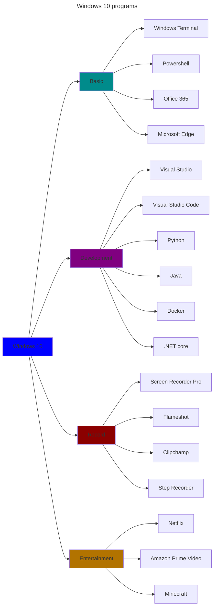

## $$\mathbb{\color{lightblue} WELCOME \space TO \space MY \space WINDOWS \space CONFIGURATION }$$

$\mathbb{\color{orange}WIKI \space HERE:}$ [Program Configurations](https://github.com/F4NT0/My_Windows_Programs/wiki)

